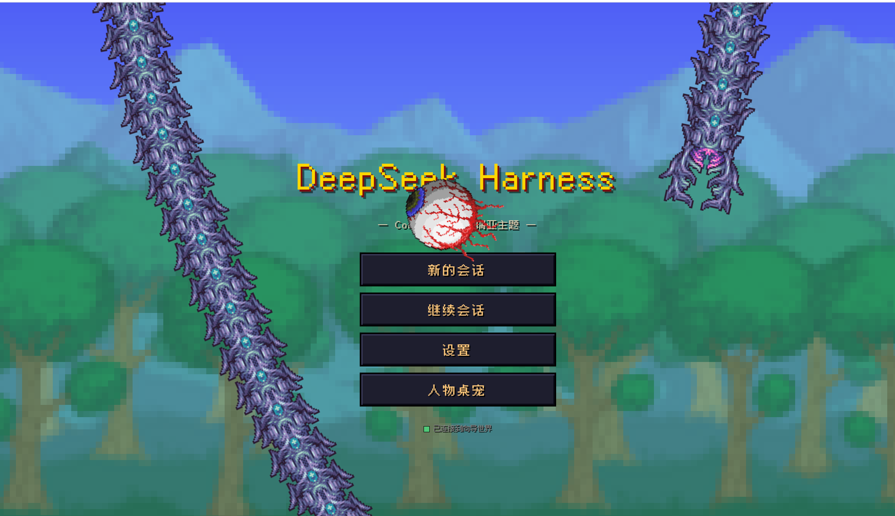

# dsh_theme_terraria

> 把 DeepSeek Harness 的 Web UI 换成一整块泰拉瑞亚（Terraria）像素世界——向导陪你写代码。
>
> [English Version](./README_EN.md)

[](https://dsh.market/?q=10086ggqq/dsh_theme_terraria)


---

## 目录

1. [项目概述与核心定位](#1-项目概述与核心定位)
2. [安装与部署指南（含避坑）](#2-安装与部署指南含避坑)
3. [视觉设计系统（UI/UX 细节）](#3-视觉设计系统uiux-细节)
4. [音效交互系统（听觉反馈）](#4-音效交互系统听觉反馈)
5. [隐藏彩蛋（叙事互动）](#5-隐藏彩蛋叙事互动)
6. [性能优化与可访问性护栏](#6-性能优化与可访问性护栏)
7. [项目维护信息（卸载、结构与许可）](#7-项目维护信息卸载结构与许可)

---

## 1. 项目概述与核心定位

**dsh_theme_terraria**（npm 包名 `dsh-theme-terraria`）是 [DeepSeek Harness](https://github.com/deepseek-ai/deepseek-harness)（dsh）的泰拉瑞亚主题插件。它用一个自包含的 `index.html`（约 98 KB，零外部 JS 依赖）替换官方 React 前端，把「AI 编码代理控制台」包装成一场像素冒险：

- **标准 dsh 插件包**：本仓库本身就是一个 npm 包——入口 `index.js` 导出插件规范硬性要求的 `apply(ctx)`，`cordis.patch.yml` 声明 `dsh.bundle` 补丁层，一条 `dsh plugin --profile web add dsh-theme-terraria` 即可安装/卸载，不改动 dsh 安装中的任何文件。
- **不是纯皮肤**：主题直连 dsh 宿主的 JSON-RPC（HTTP 上行）+ WebSocket（事件下行）协议，会话创建、消息发送、流式输出、工具审批、模型切换、工作空间管理全部真实可用。填入 DeepSeek API 密钥即可与模型对话。
- **四个难度档 = 四个 Agent 预设**：旅途（standard，全功能编码代理）、软核（code，Code Mode SDK）、中核（minimal，极简双工具）、硬核（cordis，自定义 preset 模板）。切难度就是切预设，插件的组合随难度实时变化。
- **单文件交付**：整块 UI 内联在一个 HTML 文件里，由插件直接伺服，无任何运行时框架、无构建步骤。

### 核心定位一览

| 官方 UI 概念 | 泰拉瑞亚主题映射 |
|---|---|
| Agent Preset（预设） | 难度档：旅途 / 软核 / 中核 / 硬核 |
| 会话（Session） | 旅途 / 冒险 |
| 用户消息 | 冒险者 |
| 工具审批请求 | 审批石板 |
| 任务清单（todo） | 任务清单 HUD |
| API 密钥状态 | 生命水晶指示灯 |
| 插件组合 | 随难度更换的装备 |

---

## 2. 安装与部署指南（含避坑）

### 环境要求

- 已安装的 dsh（DeepSeek Harness）CLI，命令行 `dsh --version` 可用
- Node.js `^22.19 || >=24` 与 pnpm（`dsh plugin` 内部转发给 pnpm 管理依赖）
- DeepSeek API 密钥（对话功能必需，其他界面可无密钥浏览）

### 安装步骤（标准插件安装）

```sh
# 1. 把主题作为插件安装进 web profile
dsh plugin --profile web add dsh-theme-terraria

# 2. 启动 Web 服务
dsh web
# 默认地址：http://127.0.0.1:3080/
```

`dsh plugin add` 会把 `dsh-theme-terraria` 写入 web profile 的依赖与 `dsh.profile.bundles` 层列表；本插件的 `cordis.patch.yml` 补丁层停用官方 `web-runtime` 行并插入同构的 `terraria-theme` 行，插件入口 `index.js` 导出的 `apply(ctx)` 再把官方 `@deepseek-ai/dsh-web-app` 的前端解析器指向本包的 `web/index.html`——除换皮外，官方 Web 运行时的全部行为（dist 伺服、/api 信任边界、`DSH_WEB_URL`、URL 打印）保持不变。

#### 包尚未发布到 npm 时

```sh
# 从 GitHub 仓库安装
dsh plugin --profile web add github:10086ggqq/dsh_theme_terraria

# 或从本地检出的本仓库安装
dsh plugin --profile web add /path/to/dsh_theme_terraria
```

> 在 deepseek-harness 仓库内以源码方式运行 dsh 时，上述命令加 `pnpm` 前缀（如 `pnpm dsh plugin --profile web add ...`、`pnpm dsh web`）。

### 配置 API 密钥并开始对话

1. 打开 http://127.0.0.1:3080/ ，点击「新的会话」；
2. 首次进入会自动弹出「设置」——在「DeepSeek API 密钥」输入框填入 `sk-...`，点「保存密钥」；
3. 密钥经 `credentials.set` 存到宿主机（`.dsh-home/.credentials.yaml`），页面本身不持久保存明文；
4. HUD 面板显示「API 密钥：已配置」后，在对话框输入任何指令即可开始真实对话。


### 避坑指南（实测踩过的坑）

| 坑 | 现象 | 解法 |
|---|---|---|
| 浏览器缓存旧 UI | 更新插件后页面还是旧样子 | 强制刷新 `Ctrl+F5`，或地址加 `?v=2` 绕过缓存 |
| `dsh plugin add` 失败 | 报 `pnpm not found on PATH` 或 pnpm 错误 | `dsh plugin` 内部转发给 pnpm：安装 pnpm 并重开终端；git 方式安装的报错按提示在 profile 的 `pnpm-workspace.yaml` 补 `allowBuilds` 后重试 |
| 密钥保存失败 | toast 报「保存失败」 | 确认 `dsh web` 由本机终端启动；沙箱化环境可能拦截宿主目录写入 |
| 图片壁纸存不下 | 「图片过大，保存失败」 | localStorage 上限约 5 MB，主题已自动把非 GIF 图片压缩到 1920px JPEG；仍失败请换更小的图或用视频壁纸 |
| 文件夹选择器拿不到完整路径 | 选择文件夹后只有文件夹名 | 浏览器安全限制（所有网页一致）。主题会用「使用 E:\完整\路径」按钮智能回填已注册的同名目录，否则提示手动补全 |
| WebSocket 断线 | 顶部提示「连接已断开，重连中…」 | 属正常自动重连（2 秒间隔）；宿主进程退出则需重启 `dsh web` |

---

## 3. 视觉设计系统（UI/UX 细节）

### 设计语言：像素三原色 + 石板质感

整个 UI 的视觉基调由三层构成：

1. **背景层**：默认森林壁纸（`forest.png`）+ 标题屏大树（`Tree.png`），`image-rendering: pixelated` 保持像素锐利；支持用户更换（见壁纸系统）。
2. **面板层**：所有卡片/弹窗使用「泰拉瑞亚石板」风格——深蓝双层嵌套（外框 `#181e58`，内板 `#2e3692`）、3 px 深色描边（`#0e1340`）、8 px 圆角、宋体加粗（`SimSun/Songti SC`）。
3. **点缀层**：金色（`--gold`）标题与高亮、火把橙（`--torch`）分区标题、羊皮纸白（`--parchment`）正文，配深色投影 `text-shadow: 1px 1px 0 var(--black)`。

### 字体系统

- 主字体：**Fusion Pixel 12px**（缝合像素，开源中文像素字体），单文件 `woff2` 约 600 KB，内嵌于 `web/` 目录，中文渲染无锯齿；
- 弹窗标题：宋体加粗，还原游戏原版点阵字感；
- 等宽：终端面板使用 monospace 呈现工具输出。

### 标题屏

游戏主菜单复刻：logo、四个像素菜单项（新的会话 / 继续会话 / 设置 / 人物桌宠）、森林背景上的大树剪影。

### 主对话界面（三栏布局）

- **顶栏**：返回按钮、会话名（模式@工作空间）、连接状态灯（「已连接到向导世界」）、对话/终端双标签切换、音效开关、音乐开关、设置入口；
- **对话区**：消息流（冒险者 = 用户、向导 = 助手、工具调用块可折叠）+ 底部 NPC 对话框——左侧向导立绘头像（`xiangdao.png`）与红心印记（`heart.png`），右侧输入框与六个像素按钮：**模式选择、工作空间、权限设置、模型选择、停止、发送**；
- **HUD 侧栏**：当前模型（名称+描述）、API 密钥状态灯、任务清单（todo 实时投影）、向导提示。


### 模式选择弹窗：人物创建界面 1:1 复刻

点击「模式选择」弹出泰拉瑞亚**人物创建**风格弹窗（这是全主题最还原的一处）：

- 顶栏：行走人物 gif（`Style_1_male_walking.gif`）+ 「模式选择」标题；
- 左列四个难度按钮，各自的游戏配色——旅途（紫 `#8a4b7c`）、软核（青 `#388e8d`）、中核（棕 `#855526`）、硬核（红 `#8a3a3b`）；
- 选中态：亮青色外框（`#6be1d8`）+ 内侧微光描边；
- 右侧说明面板实时显示所选难度的真实预设描述；
- 底部「返回 / 选择」大按钮，按下有 `scale(0.96)` 缩放反馈；
- 点「选择」即真实调用 `agentPreset.select` 切换后端预设，会话名随之更新。

### 设置弹窗与壁纸系统

设置弹窗分四区：

- **API 密钥**：橙色标题「DeepSeek API 密钥」+ 右侧配置状态；密码框居左（起点位置与高度不变，宽度自适应），同一行右侧依次是金色「保存密钥」按钮与工具审批模式开关（自动允许 / 手动确认），三者底边对齐；`credentials.set` 存宿主；窄屏下按钮自动换行不遮挡输入框；
- **壁纸**：虚线拖拽框「拖拽图片/视频到此处，或点击选择」——支持拖拽与点击两种上传；图片自动压缩到 1920px JPEG 存 localStorage，GIF 原样保留动画，**视频（MP4/WebM，≤512 MB）存 IndexedDB 作为全屏动态壁纸**（静音循环、垫底）；「恢复默认」一键回到森林壁纸；
- **背景音乐**：虚线拖拽框「拖拽音频到此处，或点击选择」——支持拖拽与点击上传任意音频（MP3/WAV/OGG 等，≤64 MB），存 IndexedDB 后循环播放；配「播放/暂停」按钮、音量滑块与「移除音乐」；顶栏「音乐:开/关」随时切换；
- **插件**：打开插件管理器。


### 插件管理器

读取当前难度对应预设的 `cordis.yml`，解析出全部已挂载的 dsh 插件：

- 每行显示插件名（重复挂载标 ×N）+ 中文用途说明（如 `dsh-persona 向导人格与系统提示词`）；
- `disabled: true` 的插件整行置灰并标注「已停用」；
- 「查看原始文件」按钮可展开 cordis.yml 原文对照。


### 工作空间弹窗

- 列出所有已注册工作空间（标题、完整路径、会话数），**点击任一行即在该目录开启新会话**（会话名显示如「旅途@assets」）；
- 「添加本地文件夹」支持三种方式：**选择文件夹…**（系统对话框）、**拖拽**（自动解析 file:// / Windows 路径填入）、**手动输入**完整路径；
- 选择器因浏览器安全限制只能拿到文件夹名，主题会智能匹配已注册同名目录提供「使用 E:\完整\路径」一键回填。


### 人物桌宠

标题屏「人物桌宠」打开，可以替换对话区里陪伴你的人物，并控制屏幕上游荡的五只桌宠：

- **头像上传**：拖拽或点击选择图片（≤16 MB，任意尺寸），显示为 88×88 方形头像（`object-fit: cover` 居中裁切）；存 IndexedDB，刷新后自动恢复；照片平滑渲染，默认像素画保持 `pixelated` 锐利；
- **名字编辑**：输入新名字（≤12 字，失焦或回车保存），同步更新对话区名牌、聊天气泡署名、审批石板（「XX想要使用工具」）、提问弹窗标题、欢迎语与输入框 placeholder；
- **性格设定**：文本域直接编辑，或从 `.md` / `.markdown` 文件导入（拖拽或点击，≤512KB）；导入时显示金色进度条，内容自动做去 BOM、统一换行、去首尾空白、64K 字符截断处理后入库；悬停对话区头像可速览性格前 120 字；
- **桌宠开关（五只独立控制）**：每只桌宠一个像素 toggle 开关——**克鲁苏之眼**（游荡旋转的浮空巨眼）、**史莱姆王**（蹦跳带挤压变形的史莱姆）、**嘉登**（帧动画飞行的机械师）、**神明吞噬者**（多节段跟随爬行的蠕虫）、**极地之灵**（旋转飞行的冰晶）；每只桌宠一个独立整屏透明 iframe（`pointer-events` 穿透不挡任何操作），尺寸统一 160px 标准（嘉登 133×160 保持 5:6 比例）；显示/隐藏带 0.5s 淡入淡出过渡；每只的开关状态独立存 localStorage（`terraria.pet.<id>`），刷新保持；宿主页与各 iframe 之间以 postMessage 通信（`dsh:pet` pause/resume 命令 + `dsh:pet-ack` 确认 + `dsh:pet-ready` 就绪握手，按 contentWindow 识别来源），关闭某只即冻结其动画循环省 CPU，互不影响；
- **恢复默认**：一键清掉自定义头像、名字与性格，回到向导与默认像素画。



---

## 4. 音效交互系统（听觉反馈）

主题内置一套 **8-bit 风格 WebAudio 音效引擎**——纯振荡器合成（方波），无音频文件、零网络请求：

| 事件 | 频率/时长 | 听感 |
|---|---|---|
| 助手回复完成（`assistant/message`） | 660 Hz / 60 ms | 短促「叮」，像拾取金币 |
| 工具审批请求 | 440 Hz / 100 ms | 中音提示，唤起注意 |
| 向用户提问（ask_user） | 520 Hz / 100 ms | 上扬询问音 |
| 回合失败 / 发送失败 | 180 Hz / 100 ms | 低沉「咚」，受伤音效 |

设计原则：

- **克制**：每个事件只响一声，绝不循环轰炸；流式输出过程（token 逐字到达）完全静音；
- **可关**：顶栏「音效:开 / 音效:关」一键切换，状态存 localStorage，刷新保持；
- **降级安全**：`try/catch` 包裹整个播放流程，无声环境（自动播放策略拦截、无音频设备）静默忽略，绝不抛错。

### 背景音乐（自定义 BGM）

与音效引擎相互独立的一套自定义 BGM：

- **上传**：设置弹窗中拖拽或点击选择音频文件（MP3/WAV/OGG/FLAC/M4A/AAC/OPUS，≤64 MB），存 IndexedDB（与视频壁纸同一库，绕开 localStorage 5 MB 上限），刷新后自动恢复；
- **播放**：`<audio>` 循环播放；音量滑块 0–100 实时调节并存 localStorage；顶栏「音乐:开/关」与设置内「播放/暂停」双向同步文字状态；
- **自动播放策略**：浏览器要求出声前先有一次页面交互——若刷新后音乐没有自动响起，点击页面任意位置即恢复播放；
- **卸载**：「移除音乐」清空 IndexedDB 中的 BGM 并停止播放，回到无声世界。

---

## 5. 隐藏彩蛋（叙事互动）

主题在交互细节里埋了一套贯穿始终的**冒险叙事**，细心的玩家会陆续发现：

1. **开场白**：每次新会话，消息区第一行是——「欢迎来到泰拉瑞亚！我是你的向导。」（改过人物名字后跟着叫新名字）
2. **你的名字是「冒险者」**：所有用户消息的署名都不是「我」或「User」，而是冒险者——向导对面站着的人。
3. **HUD 向导提示**（随机暗示玩法）：「危险操作会弹出审批石板；红心是对话的印记，金币是账单。」——红心 = 对话气泡的印记装饰，金币/账单 = 每轮回复附带的 token 用量统计。
4. **连接状态的世界观**：联网成功显示「已连接到向导世界」，断线显示「连接已断开，重连中…」——把 WebSocket 重连讲成了世界联结。
5. **难度档的语言体系**：模式选择里没有「standard/code/minimal」，只有旅途、软核、中核、硬核；选中软核时右侧说明是游戏原文「软核人物死亡时会掉落金钱。」——而它实际切换的是 Code Mode SDK 预设。
6. **「旅程被中断」**：你手动停止一次生成时，系统行不写「已取消」，写「旅程被中断」。
7. **人物桌宠**：标题屏「人物桌宠」点开可以换掉对话区里的人物——拖拽或点击上传照片作头像（任意尺寸，显示为 88×88，照片平滑渲染、像素画保持锐利），改名后聊天气泡署名、审批石板、欢迎语、输入框提示全部跟着换人；「性格」区可手写或从 .md 文件导入人物性格设定；「桌宠」区五只桌宠各有独立 toggle 开关——克鲁苏之眼、史莱姆王、嘉登、神明吞噬者、极地之灵，想让谁陪跑就放出谁，也可以全员出动在屏幕上开一场 Boss 巡游。
8. **行走的旅人**：模式选择弹窗顶栏那个一直在走的小人 gif——他永远在走，像在等你选好难度一起出发。

---

## 6. 性能优化与可访问性护栏

### 性能优化

| 优化点 | 做法 |
|---|---|
| **零框架运行时** | 整个 UI 是原生 DOM 操作，无 React/Vue 运行时；构建产物仅一个 98 KB HTML + 静态资源 |
| **像素字体单文件** | Fusion Pixel woff2 一次加载全站复用，无 FOIT 闪烁（`font-display` 由浏览器默认 swap） |
| **壁纸自动压缩** | 上传图片统一缩放到最长边 1920px、JPEG 质量 85%，localStorage 存量可控 |
| **视频与音乐走 IndexedDB** | 动态壁纸（≤512 MB）与自定义 BGM（≤64 MB）都存 IndexedDB，绕开 localStorage 5 MB 上限；`URL.createObjectURL` 引用，更换时 `revokeObjectURL` 释放内存 |
| **渲染锐利而便宜** | `image-rendering: pixelated` 让低分辨率素材放大不加滤镜，GPU 开销近乎为零 |
| **消息流局部更新** | 流式输出只改一个气泡的 `textContent`，不重排整列表 |

### 可访问性护栏

- **对比度**：全部正文为深底浅字（`#f4f3e6` 级别羊皮纸白 on `#2e3692` 深蓝），关键操作（发送/保存）用金色按钮强调；
- **听觉可关**：音效系统整体开关，不强制听觉反馈；
- **审批护栏**：工具默认手动确认——危险操作弹出审批石板需要人点头，自动允许是显式 opt-in 且按钮上带「谨慎使用」警告；
- **容错降级**：IndexedDB 不可用时视频壁纸静默退回静态壁纸；WebSocket 断线自动重连并明确告知状态；所有 RPC 失败都有 toast 提示而非静默吞错。

---

## 7. 项目维护信息（卸载、结构与许可）

### 目录结构（标准 dsh 插件包）

```
git/                      <- 本仓库 = 一个标准 dsh 插件包（可直接上传 GitHub）
├── package.json          <- 插件清单：包名 dsh-theme-terraria、main 入口、
│                            dsh.bundle 补丁声明、peer 依赖
├── index.js              <- 插件入口：导出 apply(ctx)，dsh plugin add 加载此模块
├── cordis.patch.yml      <- bundle 补丁层：停用官方 web-runtime，插入 terraria-theme 行
├── web/                  <- 插件伺服的主题前端 dist
│   ├── index.html            主题全部源码（HTML + CSS + JS 单文件）
│   ├── forest.png            默认森林壁纸
│   ├── Tree.png              标题屏大树
│   ├── xiangdao.png          向导头像立绘
│   ├── heart.png             红心印记
│   ├── Style_1_male_walking.gif  行走人物（模式弹窗）
│   ├── fusion-pixel-12px.woff2   像素字体
│   ├── favicon.svg           站点图标
│   ├── eoc_pet.html          克鲁苏之眼桌宠（iframe 内容页，含 postMessage 通信）
│   ├── slimeking_pet.html    史莱姆王桌宠（iframe 内容页，含 postMessage 通信）
│   ├── draedon_pet.html      嘉登桌宠（iframe 内容页，含 postMessage 通信）
│   ├── dog_pet.html          神明吞噬者桌宠（iframe 内容页，含 postMessage 通信）
│   ├── cryogen_pet.html      极地之灵桌宠（iframe 内容页，含 postMessage 通信）
│   └── manifest.webmanifest  PWA 清单
├── screenshots/          <- 实操截图（7 张）
│   ├── title-screen.png      标题屏
│   ├── chat-main.png         主对话界面
│   ├── mode-select.png       模式选择弹窗（人物创建）
│   ├── settings.png          设置弹窗（密钥/壁纸/插件）
│   ├── plugin-manager.png    插件管理器
│   ├── workspace.png         工作空间弹窗
│   └── desk-pet.png          人物桌宠弹窗
├── README.md             <- 中文文档（本文件）
├── README_EN.md          <- English documentation
└── theme.rar             <- 旧版手动安装存档（插件化之前的方式，可删除）
```

### 插件规范要点（apply(ctx) 与加载方式）

- **入口模块**：`package.json` 的 `main` 指向 `index.js`，其中导出 `name`（`'terraria-theme'`）与 `apply(ctx, config)`——导出 `apply(ctx)` 是 DeepSeek Harness 插件规范的硬性要求，也是 `dsh plugin add` 能正确加载本主题的原因；
- **apply(ctx) 做什么**：把官方 `@deepseek-ai/dsh-web-app` 插件的前端 dist 解析器（`WebApp.internals.resolveDistIndex`）替换为指向本包的 `web/index.html`，再以传入配置委托挂载官方插件——主题不重造 Web 运行时，只替换伺服的前端；
- **补丁层**：`package.json` 声明 `"dsh": { "bundle": { "patch": "./cordis.patch.yml" } }`，`dsh plugin --profile web add` 安装时据此把本包加入 profile 的 `dsh.profile.bundles` 层列表；
- **peer 依赖**：`@deepseek-ai/dsh-web-app ^0.1.0-rc.5`，由 dsh 安装侧统一解析，保证与官方 Web 运行时共享同一份 cordis 实例。

### 常用维护命令

```sh
# 修改主题：直接编辑 web/index.html（无构建步骤），重启 dsh web 生效
# 更新已安装的主题插件
dsh plugin --profile web update dsh-theme-terraria
```

### 卸载主题（恢复官方 UI）

```sh
dsh plugin --profile web remove dsh-theme-terraria
dsh web   # 重启后即恢复官方 React 前端
```

主题通过插件机制整体挂载/卸载，不修改 dsh 安装中的任何文件，卸载零残留。浏览器端的个性化数据（壁纸、背景音乐、音效开关、审批偏好）都存在浏览器 localStorage / IndexedDB，清除站点数据即可完全抹掉。

### 提交收录（dsh-plugin.org）

- 在 GitHub 仓库 **Topics** 中添加 `dsh-plugin`——收录爬虫据此识别本仓库是一个 DSH 插件；
- 本 README 已包含标准安装命令 `dsh plugin --profile web add dsh-theme-terraria`，插件入口 `index.js` 导出 `apply(ctx)`，满足收录要求；
- 顶部徽章已指向预期收录页 `https://dsh-plugin.org/plugins/10086ggqq/dsh_theme_terraria`；若收录后的实际详情页地址与之不同，把徽章链接同步改成实际地址即可。

### 许可

- 本主题：**MIT License**（与 DeepSeek Harness 仓库一致）
- 像素字体 Fusion Pixel：其各自的开源许可（详见 [Fusion Pixel Font 项目](https://github.com/TakWolf/fusion-pixel-font)）
- 泰拉瑞亚（Terraria）为 Re-Logic 的注册商标，本主题为粉丝向非官方皮肤，与 Re-Logic 无关；资源请勿商用。

---

<p align="center">愿向导的光照亮你的每一次编译。</p>
