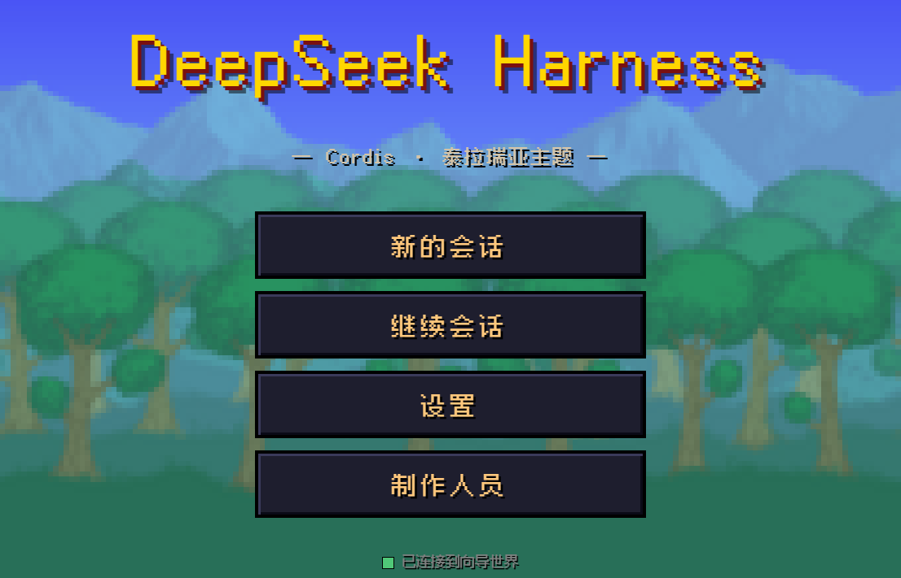
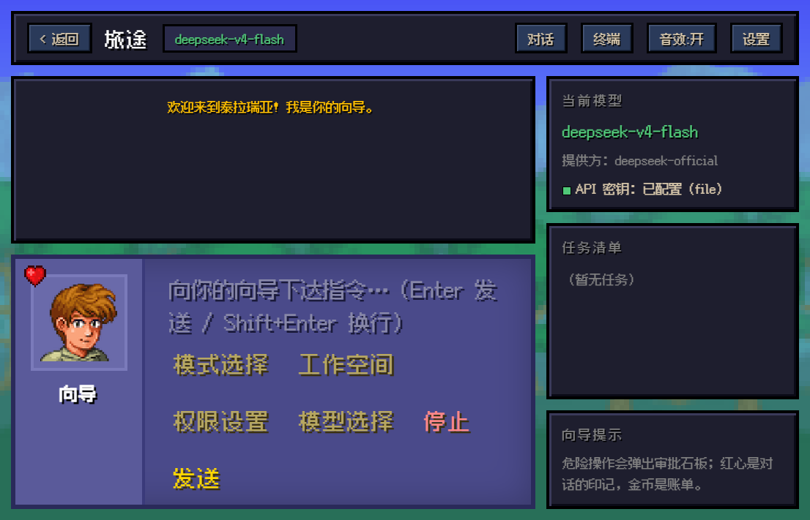
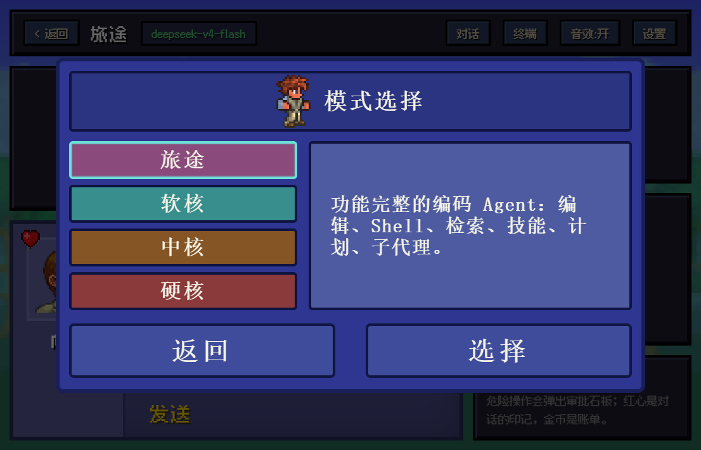
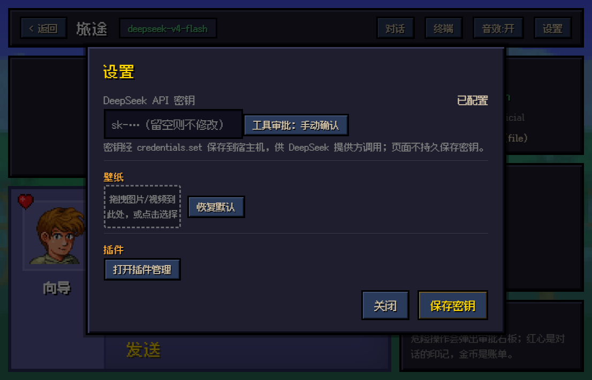
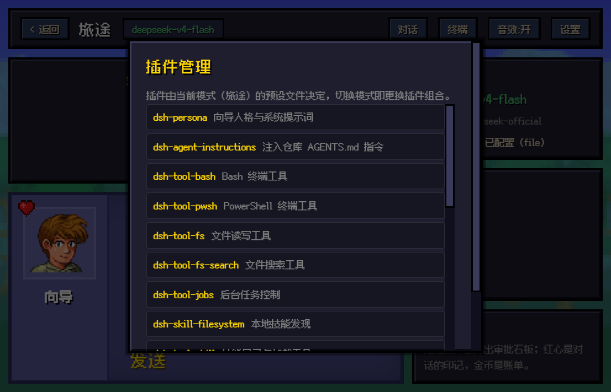
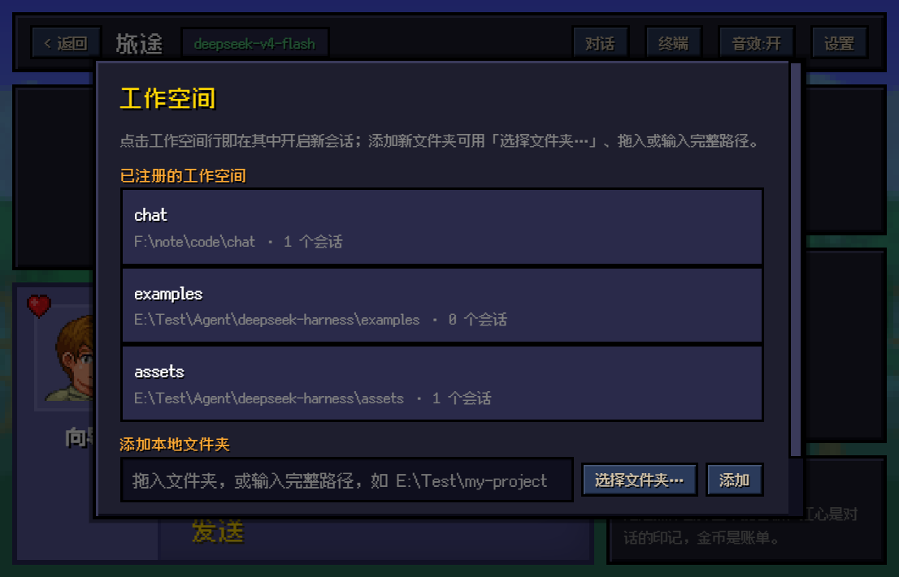
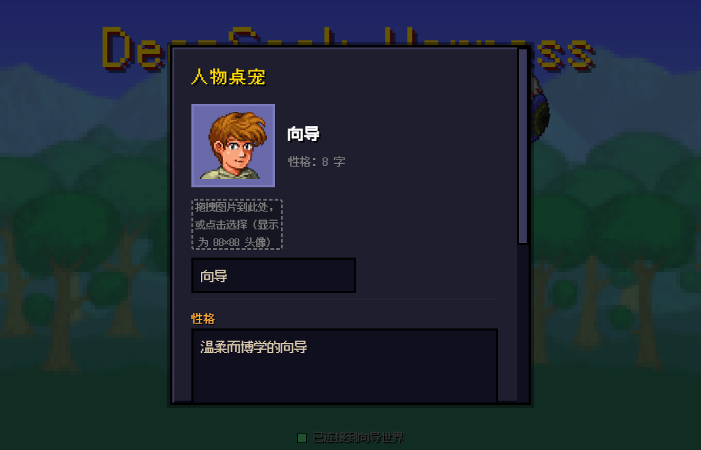

# dsh_theme_terraria

> Replace the DeepSeek Harness Web UI with an entire Terraria-style pixel world — the Guide codes alongside you.
>
> [中文版](./README.md)

[](https://dsh.market/?q=10086ggqq/dsh_theme_terraria)



---

## Table of Contents

1. [Overview & Core Positioning](#1-overview--core-positioning)
2. [Installation & Deployment Guide (with Pitfalls)](#2-installation--deployment-guide-with-pitfalls)
3. [Visual Design System (UI/UX Details)](#3-visual-design-system-uiux-details)
4. [Sound Interaction System (Audio Feedback)](#4-sound-interaction-system-audio-feedback)
5. [Hidden Easter Eggs (Narrative Interaction)](#5-hidden-easter-eggs-narrative-interaction)
6. [Performance & Accessibility Guardrails](#6-performance--accessibility-guardrails)
7. [Project Maintenance (Uninstall, Structure & License)](#7-project-maintenance-uninstall-structure--license)

---

## 1. Overview & Core Positioning

**dsh_theme_terraria** (npm package name `dsh-theme-terraria`) is a Terraria-themed plugin for [DeepSeek Harness](https://github.com/deepseek-ai/deepseek-harness) (dsh). It replaces the official React frontend with a single self-contained `index.html` (~98 KB, zero external JS dependencies), wrapping the "AI coding agent console" as a pixel adventure:

- **A standard dsh plugin package**: this repository is itself an npm package — the entry `index.js` exports the `apply(ctx)` required by the plugin spec, `cordis.patch.yml` declares the `dsh.bundle` patch layer, and a single `dsh plugin --profile web add dsh-theme-terraria` installs or removes it without touching any file in the dsh installation.
- **Not a mere skin**: the theme talks directly to the dsh host over JSON-RPC (HTTP upstream) + WebSocket (event downstream). Session creation, message sending, streaming output, tool approvals, model switching, and workspace management are all fully functional. Enter a DeepSeek API key and you can chat with the model for real.
- **Four difficulty tiers = four agent presets**: Journey (standard, full-featured coding agent), Softcore (code, Code Mode SDK), Mediumcore (minimal, bare dual-tool agent), Hardcore (cordis, custom preset template). Switching difficulty switches the preset — the plugin composition changes live with it.
- **Single-file delivery**: the entire UI is inlined in one HTML file served directly by the plugin — no runtime framework, no build step.

### Core Mapping

| Official UI concept | Terraria theme mapping |
|---|---|
| Agent Preset | Difficulty tier: Journey / Softcore / Mediumcore / Hardcore |
| Session | Journey / Adventure |
| User message | Adventurer |
| Tool approval request | Approval tablet |
| Todo list | Quest HUD |
| API key status | Life crystal indicator |
| Plugin composition | Equipment that changes with difficulty |

---

## 2. Installation & Deployment Guide (with Pitfalls)

### Requirements

- An installed dsh (DeepSeek Harness) CLI — `dsh --version` works in your terminal
- Node.js `^22.19 || >=24` and pnpm (`dsh plugin` forwards to pnpm for dependency management)
- A DeepSeek API key (required for chatting; all other UI works without one)

### Installation (standard plugin install)

```sh
# 1. Install the theme as a plugin into the web profile
dsh plugin --profile web add dsh-theme-terraria

# 2. Start the web server
dsh web
# Default URL: http://127.0.0.1:3080/
```

`dsh plugin add` writes `dsh-theme-terraria` into the web profile's dependencies and `dsh.profile.bundles` layer list; the plugin's `cordis.patch.yml` patch layer disables the official `web-runtime` row and inserts an identical `terraria-theme` row, while the plugin entry `index.js` — which exports `apply(ctx)` — points the official `@deepseek-ai/dsh-web-app` frontend resolver at this package's `web/index.html`. Everything else the official Web runtime owns (dist serving, the /api trust fence, `DSH_WEB_URL`, the URL line) keeps working unchanged.

#### Before the package is published to npm

```sh
# Install from the GitHub repository
dsh plugin --profile web add github:10086ggqq/dsh_theme_terraria

# Or install from a local checkout of this repository
dsh plugin --profile web add /path/to/dsh_theme_terraria
```

> When running dsh from source inside the deepseek-harness repository, prefix the commands with `pnpm` (e.g. `pnpm dsh plugin --profile web add ...`, `pnpm dsh web`).

### Configure the API Key and Start Chatting

1. Open http://127.0.0.1:3080/ and click "新的会话" (New Session);
2. The first visit automatically opens Settings — type your `sk-...` key into the "DeepSeek API 密钥" field and click "保存密钥" (Save Key);
3. The key is stored on the host machine via `credentials.set` (`.dsh-home/.credentials.yaml`); the page itself never persists the plaintext key;
4. Once the HUD shows "API 密钥：已配置" (configured), type any instruction into the dialog to start a real conversation.



### Pitfall Guide (All Field-Tested)

| Pitfall | Symptom | Fix |
|---|---|---|
| Browser caches old UI | Page still shows the old version after a plugin update | Hard refresh with `Ctrl+F5`, or append `?v=2` to the URL |
| `dsh plugin add` fails | `pnpm not found on PATH` or a pnpm error | `dsh plugin` forwards to pnpm: install pnpm and reopen the terminal; for git installs, follow the printed hint and add the key under `allowBuilds` in the profile's `pnpm-workspace.yaml`, then re-run |
| Key save fails | Toast reports "保存失败" | Make sure `dsh web` was started from your own terminal; sandboxed environments may block host-directory writes |
| Image wallpaper won't store | "图片过大，保存失败" | localStorage caps around 5 MB; the theme already compresses non-GIF images to 1920px JPEG. If it still fails, use a smaller image or a video wallpaper |
| Folder picker returns no full path | Only the folder name appears after selecting | Browser security restriction (uniform across the web). The theme smart-fills registered same-name directories via a "使用 E:\full\path" button; otherwise it prompts for manual completion |
| WebSocket drops | Top bar shows "连接已断开，重连中…" | Normal auto-reconnect (2s interval); if the host process exited, restart `dsh web` |

---

## 3. Visual Design System (UI/UX Details)

### Design Language: Pixel Triad + Slate Texture

The visual foundation is three layers:

1. **Background layer**: default forest wallpaper (`forest.png`) with the title-screen tree (`Tree.png`); `image-rendering: pixelated` keeps pixels crisp. User-replaceable (see wallpaper system).
2. **Panel layer**: every card/modal uses the "Terraria slate" style — nested deep-blue double layers (outer `#181e58`, inner `#2e3692`), 3 px dark outlines (`#0e1340`), 8 px corner radius, bold serif (`SimSun/Songti SC`).
3. **Accent layer**: gold (`--gold`) for titles and highlights, torch orange (`--torch`) for section headers, parchment white (`--parchment`) for body text, with a dark drop shadow `text-shadow: 1px 1px 0 var(--black)`.

### Typography

- Primary: **Fusion Pixel 12px** (an open-source CJK pixel font), a single ~600 KB `woff2` bundled in `web/` — crisp CJK rendering;
- Modal titles: bold SimSun, recreating the game's dot-matrix feel;
- Monospace: the terminal panel renders tool output in monospace.

### Title Screen

A faithful recreation of the game's main menu: logo, four pixel menu items (New Session / Continue / Settings / Desk Pet), and the big tree silhouette over the forest background.

### Main Chat Interface (Three-Column Layout)

- **Top bar**: back button, session name (mode@workspace), connection lamp ("已连接到向导世界" — connected to the Guide's world), Chat/Terminal tab switch, sound toggle, music toggle, settings entry;
- **Chat column**: message stream (Adventurer = user, Guide = assistant, collapsible tool-call blocks) plus the bottom NPC dialog box — Guide portrait (`xiangdao.png`) and heart emblem (`heart.png`) on the left, input box and six pixel buttons on the right: **Mode Select, Workspace, Permissions, Model Select, Stop, Send**;
- **HUD sidebar**: current model (name + description), API key status lamp, quest list (live todo projection), Guide tips.



### Mode Select Modal: 1:1 Character-Creation Recreation

Clicking "模式选择" opens a **character-creation**-style modal — the most faithful recreation in the whole theme:

- Top bar: walking character gif (`Style_1_male_walking.gif`) + "模式选择" title;
- Left column: four difficulty buttons in their in-game colors — Journey (purple `#8a4b7c`), Softcore (teal `#388e8d`), Mediumcore (brown `#855526`), Hardcore (red `#8a3a3b`);
- Selected state: bright cyan frame (`#6be1d8`) with an inner glow stroke;
- Right panel: live description of the selected difficulty's real preset;
- Bottom "返回 / 选择" (Back / Select) buttons with a `scale(0.96)` press feedback;
- "选择" actually calls `agentPreset.select` to switch the backend preset; the session name updates accordingly.

### Settings Modal & Wallpaper System

The settings modal has four sections:

- **API key**: an orange "DeepSeek API 密钥" heading with the config status on the right; the password input sits on the left (start position and height unchanged, width adapts), with the gold "保存密钥" (Save Key) button and the tool-approval mode switch (auto-allow / manual confirm) to its right on the same row, all bottom-aligned; stored on the host via `credentials.set`; on narrow screens the buttons wrap below instead of covering the input;
- **Wallpaper**: dashed drop zone "拖拽图片/视频到此处，或点击选择" — supports both drag-and-drop and click upload; images are auto-compressed to 1920px JPEG for localStorage, GIFs keep their animation as-is, and **videos (MP4/WebM, ≤512 MB) are stored in IndexedDB as fullscreen live wallpapers** (muted, looping, behind everything); "恢复默认" restores the forest in one click;
- **Background music**: dashed drop zone "拖拽音频到此处，或点击选择" — drag or click to upload any audio file (MP3/WAV/OGG etc., ≤64 MB), stored in IndexedDB and looped as BGM; comes with a play/pause button, a volume slider, and "移除音乐" (remove); the top-bar "音乐:开/关" (music on/off) toggles it anytime;
- **Plugins**: opens the plugin manager.



### Plugin Manager

Reads the current difficulty preset's `cordis.yml` and parses every mounted dsh plugin:

- Each row shows the plugin name (×N when mounted repeatedly) plus a Chinese usage note (e.g. `dsh-persona 向导人格与系统提示词`);
- Plugins with `disabled: true` are grayed out and tagged "已停用";
- A "查看原始文件" button expands the raw cordis.yml for comparison.



### Workspace Modal

- Lists all registered workspaces (title, full path, session count); **click any row to start a new session in that directory** (session name shows like "旅途@assets");
- "添加本地文件夹" (Add local folder) supports three methods: **Select Folder…** (system dialog), **drag-and-drop** (auto-parses file:// / Windows paths), or **manual input** of the full path;
- Because browsers only hand out the folder name from the picker, the theme smart-matches registered directories of the same name and offers a one-click "使用 E:\full\path" backfill.



### Desk Pet

Open "人物桌宠" from the title screen to swap the character keeping you company and to command the five desk pets roaming your screen:

- **Portrait upload**: drag or click to pick an image (≤16 MB, any size), shown as an 88×88 square portrait (`object-fit: cover` center-crop); stored in IndexedDB and restored after reloads; photos render smoothly while the default pixel art stays `pixelated` crisp;
- **Name editing**: type a new name (≤12 chars, committed on blur or Enter); it updates the dialog nameplate, chat-bubble signatures, the approval slate ("XX想要使用工具"), the question modal title, the welcome line, and the input placeholder;
- **Personality**: edit the textarea directly, or import from an `.md` / `.markdown` file (drag-and-drop or click, ≤512KB); the import shows a gold progress bar, and the content is processed (BOM stripped, line endings normalized, trimmed, capped at 64K chars) before saving; hover the dialog portrait to preview the first 120 characters;
- **Desk pet toggles (five independent switches)**: each pet gets its own pixel toggle — the **Eye of Cthulhu** (a wandering, rotating floating eye), **King Slime** (a bouncing slime with squash-and-stretch), **Draedon** (a frame-animated flying mechanic), **Devourer of Gods** (a multi-segment worm crawling in follow-the-leader fashion), and **Cryogen** (a spinning ice crystal in flight); each pet lives in its own full-screen transparent iframe (`pointer-events` passes through so nothing is ever blocked), sized to the shared 160px standard (Draedon 133×160 to keep its 5:6 ratio); showing/hiding plays a 0.5s fade transition; each pet's state persists independently in localStorage (`terraria.pet.<id>`) across reloads; the host page and each iframe talk over postMessage (`dsh:pet` pause/resume commands + `dsh:pet-ack` confirmations + a `dsh:pet-ready` handshake, matched by contentWindow), and closing a pet freezes only its own animation loop to save CPU;
- **Reset**: one click clears the custom portrait, name, and personality, returning to the Guide and the default pixel art.



---

## 4. Sound Interaction System (Audio Feedback)

The theme ships an **8-bit style WebAudio engine** — pure oscillator synthesis (square wave), no audio files, zero network requests:

| Event | Frequency/Duration | Feel |
|---|---|---|
| Assistant reply finished (`assistant/message`) | 660 Hz / 60 ms | A short "ding", like picking up a coin |
| Tool approval request | 440 Hz / 100 ms | Mid-tone alert drawing attention |
| Ask-user question | 520 Hz / 100 ms | Rising inquiring tone |
| Turn failed / send failed | 180 Hz / 100 ms | Low "thud", the hurt sound |

Design principles:

- **Restrained**: one beep per event, never looping; streaming (tokens arriving one by one) stays completely silent;
- **Switchable**: the top-bar "音效:开 / 音效:关" toggle persists in localStorage across reloads;
- **Fail-safe**: the whole playback path is wrapped in `try/catch` — silent environments (autoplay policy blocks, missing audio devices) are ignored without ever throwing.

### Background Music (Custom BGM)

A custom-BGM system independent of the sound-effect engine:

- **Upload**: drag or click in the settings modal to pick an audio file (MP3/WAV/OGG/FLAC/M4A/AAC/OPUS, ≤64 MB); it is stored in IndexedDB (the same database as video wallpapers, bypassing the 5 MB localStorage cap) and restored automatically after reloads;
- **Playback**: looped through an `<audio>` element; the 0–100 volume slider adjusts in real time and persists in localStorage; the top-bar "音乐:开/关" and the in-settings "播放/暂停" stay in sync;
- **Autoplay policy**: browsers require one page interaction before any sound — if the music doesn't resume by itself after a reload, click anywhere on the page and it picks up;
- **Removal**: "移除音乐" clears the BGM from IndexedDB and stops playback, returning to a silent world.

---

## 5. Hidden Easter Eggs (Narrative Interaction)

A consistent **adventure narrative** is woven through the interaction details for observant players to discover:

1. **Opening line**: every new session begins with — "欢迎来到泰拉瑞亚！我是你的向导。" (Welcome to Terraria! I am your Guide.) — and follows a renamed character's new name.
2. **Your name is "Adventurer"**: user messages are never signed "Me" or "User" — always 冒险者, the person standing across from the Guide.
3. **HUD Guide tip** (a quiet hint at the mechanics): "危险操作会弹出审批石板；红心是对话的印记，金币是账单。" — hearts = the emblem on dialog bubbles, coins/the bill = the token-usage stats attached to every reply.
4. **The connection's worldview**: a live socket reads "已连接到向导世界" (connected to the Guide's world); a dropped one reads "连接已断开，重连中…" — WebSocket reconnection told as a world bond.
5. **The difficulty lexicon**: there is no "standard/code/minimal" in mode select — only Journey, Softcore, Mediumcore, Hardcore. Pick Softcore and the side panel quotes the game verbatim: "软核人物死亡时会掉落金钱。" (Softcore characters drop coins on death.) — while it actually switches the Code Mode SDK preset.
6. **"旅程被中断"**: when you manually stop a generation, the system line doesn't say "cancelled" — it says "the journey was interrupted".
7. **Desk Pet**: the title-screen "人物桌宠" swaps the character living in the dialog box — drag or click to upload a photo as the portrait (any size, shown as 88×88; photos render smooth while the default pixel art stays crisp), and renaming updates the chat signature, approval slate, welcome line, and input placeholder all at once; the "性格" (personality) section accepts hand-written descriptions or imports them from an .md file; the "桌宠" section gives all five pets their own toggle — Eye of Cthulhu, King Slime, Draedon, Devourer of Gods, and Cryogen — release whichever you fancy, or let them all out for a full boss parade across your screen.
8. **The eternal walker**: the little gif in the mode-select header never stops walking — as if waiting for you to pick a difficulty and set off together.

---

## 6. Performance & Accessibility Guardrails

### Performance

| Optimization | Approach |
|---|---|
| **Zero-framework runtime** | The whole UI is vanilla DOM manipulation — no React/Vue runtime. The build output is one 98 KB HTML plus static assets |
| **Single-file pixel font** | The Fusion Pixel woff2 loads once and serves the whole site, no FOIT flicker |
| **Wallpaper auto-compression** | Uploaded images are scaled to a 1920px max edge at JPEG quality 85, keeping localStorage usage bounded |
| **Video & music via IndexedDB** | Live wallpapers (≤512 MB) and custom BGM (≤64 MB) both live in IndexedDB, bypassing the 5 MB localStorage cap; referenced through `URL.createObjectURL` with `revokeObjectURL` cleanup on change |
| **Cheap crisp rendering** | `image-rendering: pixelated` upscales low-res art with no filtering — near-zero GPU cost |
| **Local message updates** | Streaming only mutates one bubble's `textContent`, never re-flowing the list |

### Accessibility Guardrails

- **Contrast**: all body text is light-on-dark (parchment white `#f4f3e6` on deep blue `#2e3692`); key actions (Send/Save) are gold-highlighted buttons;
- **Audio can be muted**: the sound system has a master switch — no forced auditory feedback;
- **Approval guardrail**: tools default to manual confirmation — dangerous operations pop an approval tablet requiring a human nod; auto-allow is an explicit opt-in with a "use with caution" warning on the button;
- **Graceful degradation**: if IndexedDB is unavailable the video wallpaper silently falls back to a static one; a dropped WebSocket auto-reconnects with a clear status; every RPC failure surfaces a toast instead of being swallowed.

---

## 7. Project Maintenance (Uninstall, Structure & License)

### Repository Structure (a standard dsh plugin package)

```
git/                      <- this repository = a standard dsh plugin package (GitHub-ready)
├── package.json          <- plugin manifest: package name dsh-theme-terraria, main
│                            entry, dsh.bundle patch declaration, peer dependencies
├── index.js              <- plugin entry: exports apply(ctx), loaded by dsh plugin add
├── cordis.patch.yml      <- bundle patch layer: disables the official web-runtime,
│                            inserts the terraria-theme row
├── web/                  <- the theme frontend dist served by the plugin
│   ├── index.html            the entire theme source (HTML + CSS + JS in one file)
│   ├── forest.png            default forest wallpaper
│   ├── Tree.png              title-screen tree
│   ├── xiangdao.png          Guide portrait
│   ├── heart.png             heart emblem
│   ├── Style_1_male_walking.gif  walking character (mode modal)
│   ├── fusion-pixel-12px.woff2   pixel font
│   ├── favicon.svg           site icon
│   ├── eoc_pet.html          Eye of Cthulhu desk pet (iframe page with postMessage protocol)
│   ├── slimeking_pet.html    King Slime desk pet (iframe page with postMessage protocol)
│   ├── draedon_pet.html      Draedon desk pet (iframe page with postMessage protocol)
│   ├── dog_pet.html          Devourer of Gods desk pet (iframe page with postMessage protocol)
│   ├── cryogen_pet.html      Cryogen desk pet (iframe page with postMessage protocol)
│   └── manifest.webmanifest  PWA manifest
├── screenshots/          <- live screenshots (7)
│   ├── title-screen.png      title screen
│   ├── chat-main.png         main chat interface
│   ├── mode-select.png       mode select modal (character creation)
│   ├── settings.png          settings modal (key/wallpaper/plugins)
│   ├── plugin-manager.png    plugin manager
│   ├── workspace.png         workspace modal
│   └── desk-pet.png          desk pet modal
├── README.md             <- Chinese documentation
├── README_EN.md          <- English documentation (this file)
└── theme.rar             <- legacy manual-install archive (pre-plugin, safe to delete)
```

### Plugin Spec Essentials (apply(ctx) and how it loads)

- **Entry module**: `package.json`'s `main` points at `index.js`, which exports `name` (`'terraria-theme'`) and `apply(ctx, config)` — exporting `apply(ctx)` is a hard requirement of the DeepSeek Harness plugin spec, and the reason `dsh plugin add` can load this theme correctly;
- **What apply(ctx) does**: it swaps the official `@deepseek-ai/dsh-web-app` plugin's frontend dist resolver (`WebApp.internals.resolveDistIndex`) to point at this package's `web/index.html`, then delegates mounting of the official plugin with the passed config — the theme never reimplements the Web runtime, it only replaces the served frontend;
- **Patch layer**: `package.json` declares `"dsh": { "bundle": { "patch": "./cordis.patch.yml" } }`; on `dsh plugin --profile web add`, dsh uses it to append this package to the profile's `dsh.profile.bundles` layer list;
- **Peer dependency**: `@deepseek-ai/dsh-web-app ^0.1.0-rc.5`, resolved by the dsh installation so the theme shares the official Web runtime's cordis instance.

### Common Maintenance Commands

```sh
# Edit the theme: edit web/index.html directly (no build step), restart dsh web
# Update the installed theme plugin
dsh plugin --profile web update dsh-theme-terraria
```

### Uninstalling (Restore the Official UI)

```sh
dsh plugin --profile web remove dsh-theme-terraria
dsh web   # after restart, the official React frontend is back
```

The theme mounts and unmounts wholesale through the plugin mechanism — it never modifies any file in the dsh installation, so uninstalling leaves zero residue. Browser-side personalization (wallpaper, background music, sound toggle, approval preference) lives in localStorage / IndexedDB; clearing site data wipes it completely.

### Submitting to dsh-plugin.org

- Add the `dsh-plugin` topic to the GitHub repository's **Topics** — the listing crawler uses it to identify this repository as a DSH plugin;
- This README already contains the standard install command `dsh plugin --profile web add dsh-theme-terraria`, and the plugin entry `index.js` exports `apply(ctx)` — both listing requirements are met;
- The badge at the top already points to the expected listing page `https://dsh-plugin.org/plugins/10086ggqq/dsh_theme_terraria`; if the actual listing URL differs after approval, update the badge link accordingly.

### License

- This theme: **MIT License** (consistent with the DeepSeek Harness repository)
- Fusion Pixel font: under its own open-source license (see the [Fusion Pixel Font project](https://github.com/TakWolf/fusion-pixel-font))
- Terraria is a registered trademark of Re-Logic. This is an unofficial fan-made skin with no affiliation to Re-Logic; do not use the assets commercially.

---

<p align="center">May the Guide's torch light every build of yours.</p>
